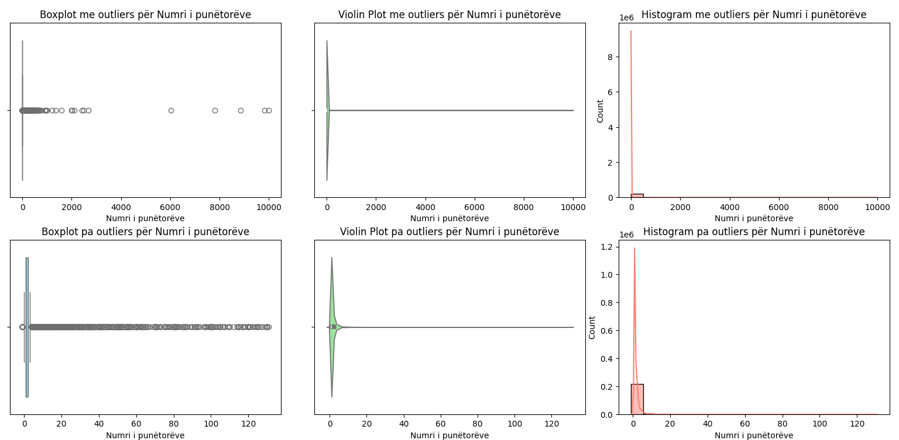
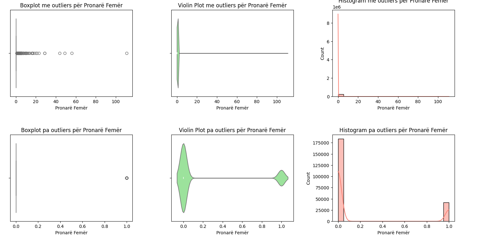
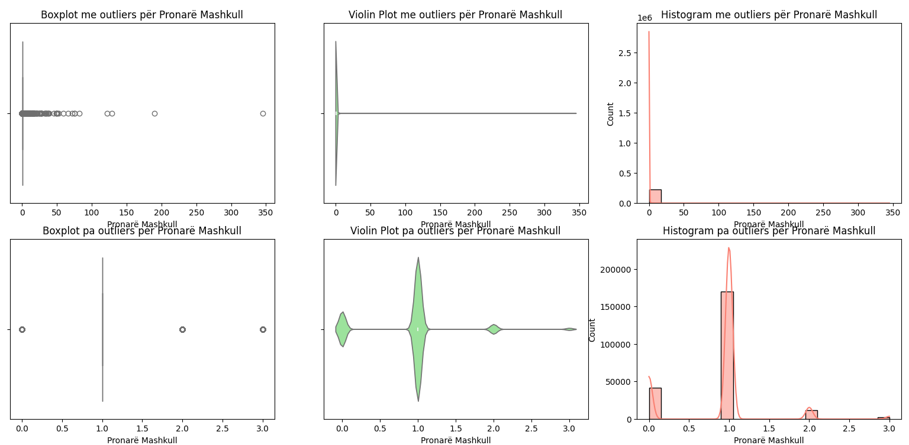
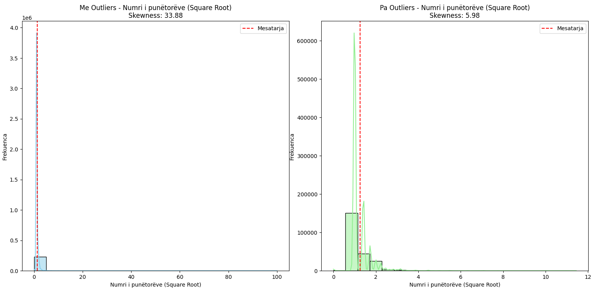
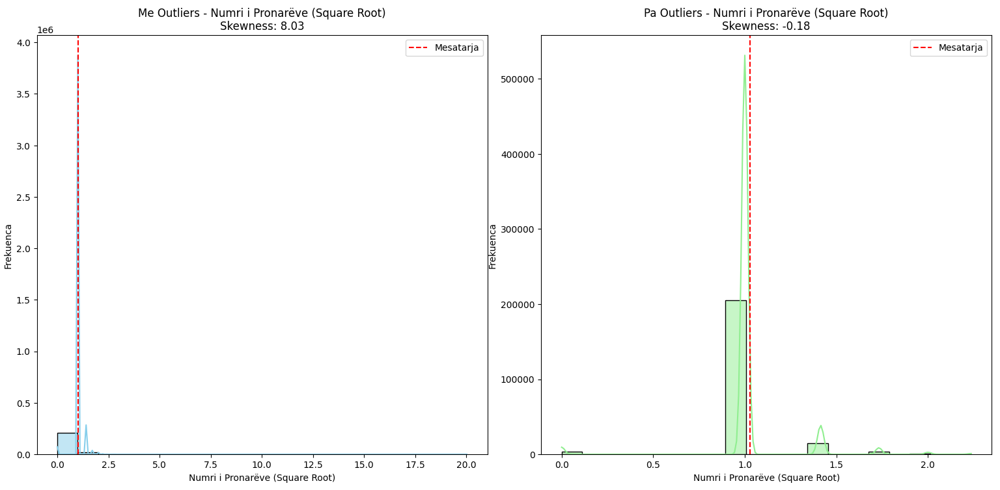
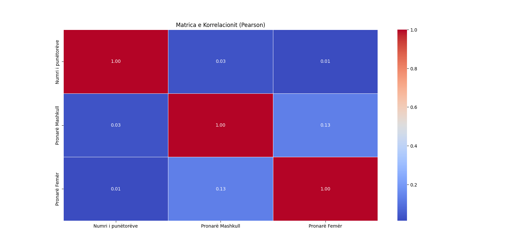

# Analizimi i Bizneseve në Republikën e Kosovës
Studimi master 2024/2025. Lënda "Pargatitja dhe vizualizimi i të dhënave". Projekt grupor "Analizimi i Bizneseve në Republikën e Kosovës".

<table>
  <tr>
   <td>
     
    </td>
    <td>
      <h2>UNIVERSITETI I PRISHTINËS “HASAN PRISHTINA”</h2>
      <p><strong>Fakulteti i Inxhinierisë Elektrike dhe Kompjuterike</p>
      <p><strong>Departamenti: </strong> Inxhinieri Kompjuterike</p>
      <p><strong>Programi: </strong>Inxhinieri Kompjuterike dhe Softuerike</p>
      <p><strong>Kodra e Diellit, p.n. - 10000 Prishtinë, Kosova</string>
    </td>
   
  </tr>
</table>
  

---

## Detajet e lëndës
- **Përgatitja dhe vizualizimi i të dhënave**
- **Dr. Sc. Mërgim H. HOTI**
- **Asst. Dr. Sc. Mërgim H. HOTI**
- **Niveli:** Master
- **Viti akademik:** 2024/2025

---


## Grupi punues
  - Driton Alija
  - Muhamed Zahiri
  - Jusuf Maksuti
  

Të dhënat zyrtare të ARBK-së
**Lidhja** 
- [ ] Faqja kryesore: `https://arbk.rks-gov.net`

Të dhënat e marra nga faqja `Open Businesses Kosova` 
**Lidhjet** 
- [ ] Faqja kryesore: `https://biznesetehapura.com`
- [ ] Faqja për marrjen e të dhënave: `https://biznesetehapura.com/info`

## Përmbajtja

- [Analizimi i Bizneseve në Republikën e Kosovës](#analizimi-i-bizneseve-në-republikën-e-kosovës)
  - [Detajet e lëndës](#detajet-e-lëndës)
  - [Grupi punues](#grupi-punues)
  - [Përmbajtja](#përmbajtja)
  - [Përshkrimi i projektit](#përshkrimi-i-projektit)
    - [Objektivat kryesore:](#objektivat-kryesore)
- [Faza e parë - Para-Procesimi i të Dhënave](#faza-e-parë---para-procesimi-i-të-dhënave)
  - [Kërkesat](#kërkesat)
    - [Struktura e të dhënave](#struktura-e-të-dhënave)
      - [Struktura para përpunimit](#struktura-para-përpunimit)
      - [Struktura pas përpunimit](#struktura-pas-përpunimit)
    - [Përgatitja e të dhënave](#përgatitja-e-të-dhënave)
    - [Skriptet Përgjegjëse](#skriptet-përgjegjëse)
    - [Ruajtja e të Dhënave](#ruajtja-e-të-dhënave)
- [Faza e dytë e projektit - Detektimi i përjashtuesve dhe mënjanimi](#faza-e-dytë-e-projektit---detektimi-i-përjashtuesve-dhe-mënjanimi)
    - [**Z-Score**](#z-score)
    - [**IQR (Interquartile Range)**](#iqr-interquartile-range)
    - [**Detektimi i Vlerave me Frekuencë të ulët**](#detektimi-i-vlerave-me-frekuencë-të-ulët)
    - [**Vizualizimi i Përjashtueve**](#vizualizimi-i-përjashtueve)
    - [**Detektimi i Datave të Pavlefshme**](#detektimi-i-datave-të-pavlefshme)
  - [Statistika Përmbledhëse dhe Multivariante](#statistika-përmbledhëse-dhe-multivariante)
    - [**Statistika Përmbledhëse**](#statistika-përmbledhëse)
    - [**Vizualizimi me Transformim Square Root**](#vizualizimi-me-transformim-square-root)
    - [**Analiza Multivariante**](#analiza-multivariante)
    - [Raport i Analizës së Bizneseve](#raport-i-analizës-së-bizneseve)
      - [**Pikat Kryesore të Raportit**](#pikat-kryesore-të-raportit)
      - [**Analiza Avancuara**](#analiza-avancuara)
      - [**Vizualizime**](#vizualizime)
    - [Skriptet Përgjegjëse](#skriptet-përgjegjëse-1)
- [Faza e tretë - Vizualizimi i të dhënave](#faza-e-tretë---vizualizimi-i-të-dhënave)
- [Informata teknike të projektit](#informata-teknike-të-projektit)
  - [Struktura e Projektit](#struktura-e-projektit)
  - [Kërkesat](#kërkesat-1)
  - [Instalimi](#instalimi)

## Përshkrimi i projektit

Projekti ka për qëllim mbledhjen, përgatitjen dhe pastrimin e të dhënave të bizneseve të Kosovës, duke krijuar një dataset të pastër dhe të përgatitur për analiza të mëtejshme. Në kuadër të këtij projekti, përdoren teknika të ndryshme të përpunimit të të dhënave për të përmirësuar cilësinë dhe për të krijuar fusha të reja të dobishme për analizë. 

### Objektivat kryesore:  
- Analizimi i bizneseve sipas aktiviteteve.  
- Analizimi sipas statusit dhe gjinisë së pronarëve.  
- Analizimi sipas komunave.  
- Analizimi i regjistrimeve ndër vite.  
- Studimi i rritjes së bizneseve në kohë.  
- Analizimi sipas numrit të punëtorëve.  
- Analiza parashikuese për zhvillimin ekonomik.  
  

Këto statistika do të ndihmojnë në kuptimin më të mirë të strukturës dhe trendeve të bizneseve në Kosovë.

Projekti do të kalojë në 3 faza deri në rezultatin final. Së pari, do të përgatiten të dhënat duke zgjedhur atributet, duke përmirësuar mungesat e të dhënave, integrimin e tyre, agregimin, binarizimin dhe transformimin.
Më pas, do të largohen përjashtimet nga të dhënat, do të bëhen analiza statistikore të të dhënave, menjanimi i të dhënave jo të sakta dhe analiza të ndërlidhjes së atributeve. Në fazën e fundit, të gjitha këto rezultate do të paraqiten në formë dinamike.


# Faza e parë - Para-Procesimi i të Dhënave
## Kërkesat

Para-procesimi për përgatitjen e të dhënave për analizë.

Mbledhja e të dhënave, definimi i tipeve të dhënave, kualiteti i të
dhënave.

Integrimi, agregimi, mostrimi, pastrimi, identifikimi dhe strategjia e
trajtimit për vlerat e zbrazëta.

Reduktimi i dimensionit, zgjedhja e nën bashkësisë së vetive, krijimi
i vetive, diskretizimi dhe binarizimi, transformimi.

### Struktura e të dhënave

Të dhënat janë marrë nga [Open Businesses Kosova](https://biznesetehapura.com/info) për periudhën e 20 viteve të fundit (deri në vitin 2023). Fillimisht, të dhënat për secilin vit janë ruajtur veçmas dhe më pas janë bashkuar në një file të vetëm për analizë.

#### Struktura para përpunimit 

| Emri i biznesit            | Statusi | Numri fiskal | Tipi i biznesit     | Kapitali | Numri i punëtorëve | Pronarë       | Gjinia e pronarit | Personat e autorizuar | Data e regjistrimit | Linku në ARBK                                                                 | Numri i regjistrimit | Komuna | Aktivitetet         |
|-----------------------------|---------|--------------|---------------------|----------|--------------------|---------------|-------------------|-----------------------|----------------------|--------------------------------------------------------------------------------|-----------------------|---------|----------------------|
| John Doe B.I.        | Aktiv   | 600917621    | Biznes individual  | 0        | 1                  | John Doe  | Mashkull          | John                 | 2013-01-01  | (http://arbk.rks-gov.net/page.aspx?id=1,38,103658)                        | 70920638              | Lipjan  | Aktivitete juridike |


#### Struktura pas përpunimit 

| Emri i biznesit | Statusi   | Tipi i biznesit         | Data e regjistrimit | Data e mbylljes | Komuna     | Numri i punëtorëve | Pronarë Mashkull | Pronarë Femër | Aktiviteti Primar | Aktiviteti Sekondar
|-----------------|-----------|-------------------------|----------------------|-----------------|------------|----------|--------------------|------------------|---------------|----------------------|
| John Doe B.I.   | 1    | 1       | 2013-01-01          | 2023-01-01      | 1               | 1                  | 1                | 0             | 601                 | 605 


### Përgatitja e të dhënave  

Si fillim, të gjitha të dhënat janë kategorizuar duke eliminuar tekstet e gjata. Janë kategorizuar kolonat si **Statusi**, **Komuna**, **Tipi i Biznesit** dhe **Aktiviteti**.  

Më pas, janë larguar fushat e panevojshme dhe ato që konsiderohen të pabesueshme, të cilat nuk ndikojnë në statistikat tona të planifikuara.  

Janë përdorur strategji të ndryshme për të zëvendësuar vlerat që mungojnë.  

Është ndërtuar një **web crawler** që përdor framework-un Playwright për të marrë të dhëna nga faqja zyrtare e ARBK-së (`https://arbk.rks-gov.net/`). Ky crawler nxjerr të dhëna për bizneset bazuar në emrin e tyre, duke na mundësuar zëvendësimin e disa vlerave që mungonin, veçanërisht për kolonën **Komuna**.  

Si identifikues unik për datasetin tonë, kemi përdorur **Numrin e Regjistrimit** të çdo biznesi, të cilin e kemi nxjerrë nga të dhënat e papërpunuara.  

Të dhënat për gjinitë janë plotësuar duke përdorur një funksion dhe një librari për detektimin e gjinisë bazuar në emrin e pronarit.  

Duke u bazuar në strukturën aktuale, kemi krijuar disa kolona të reja, si:  
- `Pronarë Femër`  
- `Pronarë Mashkull`  
(këto kolona përcaktojnë numrin e pronarëve në një biznes).  

Datat janë kontrolluar me kujdes dhe janë normalizuar për të siguruar qëndrueshmëri.  

Të dhënat janë integruar, diskretizuar, binarizuar dhe agreguar, duke krijuar veti të reja, si:  
- **Vjetërsia e Biznesit**  
- **Numri i Punëtorëve**  

Nga kolona **Aktivitetet**, janë nxjerrë `Aktiviteti Primar` dhe `Aktiviteti Sekondar`, për të përfaqësuar më saktësisht fushën kryesore dhe dytësore të aktivitetit të biznesit.  

Janë hequr të gjitha rekordet e dyfishta dhe janë përzgjedhur mostra për analizë.  

### Skriptet Përgjegjëse  
Të gjitha këto përpunime janë realizuar përmes skripteve të mëposhtme:
- `data_preparation.py`
- `dataset_info.py`
- `data_samples.py`
- `data_transformation.py`
- `arbk_crawler.py`
- `merge_data.py`  

### Ruajtja e të Dhënave  
Të gjitha vlerat e grupeve, si:  
- `Statusi`  
- `Komuna`  
- `Tipi i Biznesit`  
- `Aktiviteti Primar`  
- `Aktiviteti Sekondar`  

janë ruajtur në një skedar `JSONL`. Në të dhënat e procesuara janë përdorur vlera numerike për performancë më të mirë gjatë analizave dhe vizualizimeve.

# Faza e dytë e projektit - Detektimi i përjashtuesve dhe mënjanimi

Në këtë fazë janë përdorur teknika statistikore dhe vizuele për të detektuar përjashtuesit nga dataseti jonë.

Një nga hapat më të rëndësishëm në analizën e të dhënave është identifikimi dhe trajtimi i përjashtuesve, të cilët mund të deformojnë rezultatet statistikore dhe analizat multivariat. Në këtë kontekst, janë përdorur metoda të shumta për detektimin e përjashtuesve:

### **Z-Score**
- **Metodologjia:** Llogarit Z-scores për të matur largësinë e një vlere nga mesatarja në njësi të devijimit standard.
- **Zbatimi:** Të dhënat me Z-score më të madh se një prag (zakonisht 3) identifikohen si përjashtues.
- **Rezultati:** Ky proces ndihmon në identifikimin e përjashtuesve për kolonat numerike si `Numri i punëtorëve`, `Pronarë Femër` dhe `Pronarë Mashkull`.

### **IQR (Interquartile Range)**
- **Metodologjia:** Përdor kuartilet për të llogaritur kufijtë e poshtëm dhe të sipërm, duke trajtuar të dhënat jashtë këtyre kufijve si përjashtues.
- **Zbatimi:** E dobishme për të identifikuar përjashtues në shpërndarje jo-normale.
- **Rezultati:** Ky proces përmirëson identifikimin e përjashtuesve në dataset.

Në rastin tonë, teknika Z-Score rezultoi të ishte më e suksesshme dhe më e përshtatshme krahasuar me metodën IQR. Prandaj, e kemi përdorur si metodë primare për të identifikuar dhe eliminuar vlerat përjashtuese (outliers). Për arsye statistikore, kemi mundësuar konfigurimin e një pragu (threshold) që lejon përfshirjen e të dhënave që konsiderohen outliers, por që janë të rëndësishme për vizualizimet statistikore në këtë rast.

### **Detektimi i Vlerave me Frekuencë të ulët**
   - Identifikon vlera me frekuencë të ulët në kolona kategorike(nominale).
   - Ndihmon në zbulimin e vlerave të rralla ose të pasakta.

###  **Vizualizimi i Përjashtueve**
   - Vizualizon kolonat numerike me dhe pa outliers duke përdorur:
     - Boxplot
     - Violin plot
     - Histogram

### **Detektimi i Datave të Pavlefshme**
   - Kontrollon për data të pavlefshme, si `Data e regjistrimit` apo `Data e mbylljes`.
   - Detekton dhe regjistron anomalitë për inspektim të mëtejshëm.
  
Të gjitha metodat e përmendura më sipër përdoren për të identifikuar anomalitë në dataset-in tonë. Këto anomali ruhen në një file të veçantë `detected_outliers.csv`, ku shënohet edhe arsyeja e saktë pse janë klasifikuar si outliers.

Nga dataset-i ynë, kemi identifikuar outliers në vetëm 1% të rasteve, që përfaqëson afërsisht 2000 nga 230,000 të dhëna.

<div align="center">
  
  <p><i>Figura 1. Vizualizimi i përjashtuesve për "Numrin e punëtorëve"</i></p>
</div>

<div align="center">
  
  <p><i>Figura 2. Vizualizimi i përjashtuesve për "Pronarë Femër"</i></p>
</div>
<div align="center">
  
  <p><i>Figura 3. Vizualizimi i përjashtuesve për "Pronarë Mashkull"</i></p>
</div>


Pasi përjashtuesit identifikohen, është e rëndësishme që të largohen ose të trajtohen në mënyrë të tillë që të dhënat të mos humbin informacione të vlefshme. Për këtë qëllim, janë përdorur teknika si:


##  Statistika Përmbledhëse dhe Multivariante

Eksplorimi i të dhënave përbën bazën për analizat më të avancuara. Në këtë proces, janë kryer analiza eksploruese në dy nivele: statistikë përmbledhëse dhe analiza multivariante.

### **Statistika Përmbledhëse**
- **Përmbledhja:** Janë analizuar përmasat kryesore të të dhënave, si mesatarja, devijimi standard dhe shpërndarja për kolonat numerike.
- **Vizualizimi:** Histogramet dhe boxplot-et janë përdorur për të treguar shpërndarjen e të dhënave dhe për të identifikuar përjashtuesit.
  

|             | Statusi        | Tipi i Biznesit | Komuna         | Pronarë Femër | Aktiviteti Primar | Aktiviteti Sekondar |
|-------------|----------------|-----------------|----------------|---------------|-------------------|---------------------|
| **count**   | 228,684.000    | 228,684.000     | 228,684.000    | 228,684.000   | 228,684.000       | 228,684.000         |
| **mean**    | 0.715          | 2.459           | 17.861         | 0.201         | 341.253           | 455.164             |
| **std**     | 0.704          | 3.967           | 10.050         | 0.539         | 207.407           | 202.422             |
| **min**     | 0.000          | 0.000           | 0.000          | 0.000         | 0.000             | 0.000               |
| **25%**     | 0.000          | 0.000           | 8.000          | 0.000         | 115.000           | 319.000             |
| **50%**     | 1.000          | 0.000           | 23.000         | 0.000         | 420.000           | 556.000             |
| **75%**     | 1.000          | 9.000           | 25.000         | 0.000         | 545.000           | 606.000             |
| **max**     | 2.000          | 10.000          | 35.000         | 111.000       | 610.000           | 610.000             |


### **Vizualizimi me Transformim Square Root**
- **Qëllimi:** Trajton shpërndarjet e të dhënave asimetrike duke aplikuar transformim Square Root.
- **Rezultati:** 
  - Histogramet tregojnë shpërndarjen e dhënave për kolonat numerike si `Numri i punëtorëve` dhe `Numri i Pronarëve`.
  - Skewness është llogaritur për të vlerësuar nivelin e asimetrisë së të dhënave, duke përmirësuar analizën vizuale të shpërndarjeve.
  <div align="center">
    
    <p><i>Figura 4. Shtrembërimi i të dhënave "Numri i punëtorëve"</i></p>
  </div>
  <div align="center">
    
    <p><i>Figura 5. Shtrembërimi i të dhënave "Pronarë"</i></p>
  </div>

### **Analiza Multivariante**
- **Chi-Square Test:** Teston pavarësinë mes kolonave nominale si `Komuna` dhe `Tipi i biznesit`.
- **Korrelacioni dhe Kovarianca:** Analizon marrëdhëniet midis kolonave numerike si `Numri i punëtorëve` dhe `Pronarë Femër`.
- **Vizualizimi:** Matrica e korrelacionit(pearson) dhe countplot-et tregojnë ndërveprimet dhe shpërndarjet ndërmjet kolonave.
 **Rezultatet e Chi-Square Test për kolonat nominale**

| Atributi 1           | Atributi 2          | Chi2           | p-value |
|-----------------------|---------------------|----------------|---------|
| Tipi i biznesit       | Komuna             | 2.040615e+04   | 0.0     |
| Tipi i biznesit       | Aktiviteti Primar  | 1.047650e+05   | 0.0     |
| Tipi i biznesit       | Aktiviteti Sekondar| 9.125172e+04   | 0.0     |
| Komuna               | Aktiviteti Primar  | 1.106152e+05   | 0.0     |
| Komuna               | Aktiviteti Sekondar| 8.303073e+04   | 0.0     |
| Aktiviteti Primar    | Aktiviteti Sekondar| 9.952439e+06   | 0.0     |

**Korrelacioni dhe Kovarianca për kolona numerike**

| Atributi 1           | Atributi 2        | Pearson Correlation | Covariance |
|-----------------------|-------------------|----------------------|------------|
| Numri i punëtorëve   | Pronarë Mashkull | 0.030874             | 1.647895   |
| Numri i punëtorëve   | Pronarë Femër    | 0.012756             | 0.300046   |
| Pronarë Mashkull     | Pronarë Femër    | 0.131419             | 0.086719   |
<div align="center">
  
  <p><i>Figura 6. Matrica e korrelacionit(Pearson)</i></p>
</div>

Gjiashtu kemi krijuar disa statistika  te rendesishme te cilat do ti zgjerojme ne fazen  e ardhshme.

### Raport i Analizës së Bizneseve

#### **Pikat Kryesore të Raportit**

- **Tipet e Bizneseve**: Numri më i madh i bizneseve sipas tipit.
- **Komunat**: Komuna me numrin më të madh të bizneseve.
- **Statusi i Bizneseve**: Shumica e bizneseve janë aktive (p.sh., 80%).
- **Aktivitetet Primare**: Aktiviteti më i zakonshëm.
- **Ndarja Gjinore**:
  - Pronarë meshkuj: **70%**
  - Pronarë femra: **30%**

#### **Analiza Avancuara**

- **Zhvillimi Ekonomik**: 
  - Komuna me mesataren më të lartë të punëtorëve: Komuna A.
  - Mesatarja e përgjithshme e punëtorëve: **X punëtorë**.

- **Dominimi i Pronareve Femra**:
  - Përqindja më e lartë në sektorin Z: **Y%**.

- **Diversifikimi i Aktivitetit**:
  - **X%** e bizneseve kanë aktivitete sekondare.

- **Shpërndarja e Punëtorëve**:
  - Aktiviteti me numrin më të lartë të punëtorëve: Aktiviteti Z.

#### **Vizualizime**
- Histogram për tipet e bizneseve.
- Grafik Pie për ndarjen gjinore të pronarëve.
- Grafik Bubble për përqendrimin e punëtorëve sipas komunës.

### Skriptet Përgjegjëse  
Të gjitha këto përpunime janë realizuar përmes skripteve të mëposhtme:
- `outliers.py`
- `correlation.py`
- `data_explore.py`
- `skewness.py`
- `data_stats.py`

# Faza e tretë - Vizualizimi i të dhënave
- `TODO`
# Informata teknike të projektit

## Struktura e Projektit

- `data/`: Dosja që përmban dataset-in e papërpunuar (`raw`) dhe atë të përpunuar (`processed`).
- `notebooks/`: Përmban notebook-e për analiza dhe vizualizime. TODO
- `docs/`: Dokumentacioni i fazave të projektit.
- `src/`: Skriptet Python për mbledhjen dhe përgatitjen e të dhënave, analizën, dhe përpunimin.
- `LICENSE`: Skedari i licencës së projektit.
- `README.md`: Skedari kryesor i përshkrimit të projektit.
- `requirements.txt`: Kërkesat për bibliotekat e nevojshme Python.

## Kërkesat

- [Python 3.8+](https://www.python.org/)
- Libraritë e përmendura në `requirements.txt`

## Instalimi

1. Klononi këtë repo nga GitHub:
   ```bash
   git clone https://github.com/dritonalija/Analizimi-i-Bizneseve-ne-Republiken-e-Kosoves.git

2. cd Analizimi-i-Bizneseve-ne-Republiken-e-Kosoves

   pip install -r requirements.txt
3. cd src 

   python data_preparation.py


> Ky projekt është i licencuar nën Licencën MIT. Kjo licencë u lejon përdoruesve të kopjojnë, modifikojnë dhe shpërndajnë këtë softuer për çdo qëllim, duke përfshirë edhe përdorime komerciale. Ndryshimet dhe përshtatjet e kodit janë të lejuara, për sa kohë që deklarata e të drejtës së autorit origjinal ruhet në të gjitha kopjet. Licenca MIT nuk garanton asnjë përgjegjësi ose garanci për përdorimin e këtij softueri.
